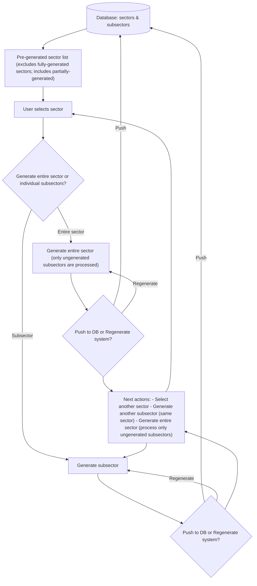

# Sector Generation Data Flow

Mermaid diagram showing the flow for selecting and generating pre-generated sectors/subsectors.

## Mapping to requested steps

1. Show a pre-generated sector list (do not allow already fully-generated sectors; allow partially-generated sectors).
2. User chooses to generate the entire sector or individual subsectors. "Entire" generation only processes subsectors that are not yet generated.
   3a) After generating entire sector: choose to push results to the database or regenerate the system.
   3b) After generating a subsector: choose to push results to the database or regenerate the system.
3. After push/regenerate: user may return to the sector list, generate another subsector, or trigger an (idempotent) entire-sector generation for remaining subsectors.

## Notes

- The list display should filter out sectors where every subsector is already marked as generated.
- "Regenerate" means re-run generation for the selected scope (subsector or entire sector) and optionally overwrite database entries.
- Entire-sector generation must be implemented to skip already-generated subsectors to avoid redundant work.
