# Database Schema for Eclipsed Horizon documentation

## Summary

- [Introduction](#introduction)
- [Database Type](#database-type)
- [Table Structure](#table-structure)
  - [stars](#stars)
  - [star_systems](#star_systems)
  - [worlds](#worlds)
  - [gas_giants](#gas_giants)
  - [planetoid_belts](#planetoid_belts)
  - [empty_orbit](#empty_orbit)
  - [moons](#moons)
  - [moon_gas_giants](#moon_gas_giants)
  - [moon_rings](#moon_rings)
  - [system_history](#system_history)
- [Relationships](#relationships)
- [Database Diagram](#database-diagram)

## Introduction

Link [https://drawdb.vercel.app/editor?shareId=0e6eacce4004229bd01c87c5a44a785c]: weblink

## Database type

- **Database system:** SQLite

## Table structure

### stars

Individual stars in a system (binary/trinary systems have multiple rows)
| Name | Type | Settings | References | Note |
|-------------|---------------|-------------------------------|-------------------------------|--------------------------------|
| **star_id** | INTEGER | 🔑 PK, not null, unique, autoincrement | fk_stars_star_id_worlds,fk_stars_star_id_gas_giants,fk_stars_star_id_planetoid_belts,fk_stars_star_id_empty_orbit |Unique star ID |
| **system_id** | INTEGER | null | | |
| **name** | TEXT(65535) | null | |Name of the star |
| **object** | TEXT(65535) | null | |Stellar, Primordial, Post-Stellar, Sub-Stellar, Protostars, Nebulae |
| **position** | TEXT(65535) | null | |Primary, Primary Companion, Close, Close Companion, Near, Near Companion, Far, Far Companion |
| **component** | TEXT(65535) | null | |Primary, Secondary, Companion |
| **category** | TEXT(65535) | null | |Primary, Random, Lesser, Sibling, Twin, Other, NS, D, BD |
| **designation** | TEXT(65535) | null | |"A", "Aa","Ab", "B", "Ba", "Bb", "C", "Ca", "Cb", "D", "Da", "Db" |
| **type** | TEXT(65535) | null | |"A", "B", "F", "G", "K", "M", "O", "L", "T", "Y" |
| **subtype** | INTEGER | null | |0-9 or null |
| **class** | TEXT(65535) | null | |Ia, Ib, II, III, IV, V, VI, NS, BD, D, BH, NB, PL, PS, SC, AN |
| **mass** | REAL | null | |Mass in solar masses |
| **diameter** | REAL | null | |Diameter in solar diameters |
| **luminosity** | REAL | null | |Luminosity in solar luminosities |
| **temperature** | REAL | null | |Surface temperature in Kelvin |
| **age** | REAL | null | |Age in billions of years (Gyr) |
| **mao** | REAL | null | |minimum allowable orbit |
| **orbit_number** | NUMERIC | null | |Orbital position |
| **orbit_au** | NUMERIC | null | |Orbit distance in AU |
| **eccentricity** | REAL | null | |Orbital eccentricity (0.0-1.0) |
| **separation_minimum** | REAL | null | |minimum separation value |
| **separation_maximum** | REAL | null | |maximum separation value |
| **orbit_minimum** | REAL | null | | |
| **orbit_maximum** | REAL | null | | |
| **available_orbits** | REAL | null | | |
| **orbit_list** | TEXT(65535) | null | | |
| **orbital_period** | REAL | null | | |
| **hzco_au** | REAL | null | | |
| **hzco_number** | REAL | null | | |
| **hzco_deviation** | REAL | null | | |
| **assigned_worlds** | REAL | null | | |
| **maximum_spread** | REAL | null | | |

### star_systems

Stores metadata about each generated star system
| Name | Type | Settings | References | Note |
|-------------|---------------|-------------------------------|-------------------------------|--------------------------------|
| **system_id** | INTEGER | 🔑 PK, not null, unique, autoincrement | fk_star_systems_id_stars,fk_star_systems_system_id_system_history |Unique system ID |
| **sector** | TEXT(65535) | null | |Sector name (e.g., "Orion Spur") |
| **subsector_name** | TEXT(65535) | null | | |
| **subsector_postion** | TEXT(65535) | null | |A to P |
| **system_name** | TEXT(65535) | null | |Name of the system |
| **system_seed** | INTEGER | null | |Seed used for generation (for reproducibility) |
| **created_at** | DATETIME | null | |When system was created |
| **updated_at** | DATETIME | null | |When system was last modified |
| **hex** | TEXT(65535) | null | | |
| **total_stars** | NUMERIC | null | | |
| **total_orbits** | NUMERIC | null | | |
| **total_worlds** | NUMERIC | null | | |
| **total_moons** | NUMERIC | null | | |
| **gas_giants** | NUMERIC | null | | |
| **planetoid_belts** | NUMERIC | null | | |
| **terrestrial_planets** | NUMERIC | null | | |
| **empty_orbits** | NUMERIC | null | | |
| **available_system_orbits** | NUMERIC | null | | |
| **baseline** | NUMERIC | null | | |
| **baseline_orbit** | NUMERIC | null | | |
| **spread** | REAL | null | | |

#### Indexes

| Name          | Unique | Fields    |
| ------------- | ------ | --------- |
| idx_system_id |        | system_id |

### worlds

Worlds orbiting stars
| Name | Type | Settings | References | Note |
|-------------|---------------|-------------------------------|-------------------------------|--------------------------------|
| **world_id** | INTEGER | 🔑 PK, not null, unique, autoincrement | fk_worlds_world_id_moons,fk_worlds_world_id_moon_gas_giants,fk_worlds_world_id_moon_rings | |
| **star_id** | INTEGER | null | | |
| **name** | TEXT(65535) | null | | |
| **uwp_starport** | TEXT(65535) | null | | |
| **uwp_size** | TEXT(65535) | null | | |
| **uwp_atmosphere** | TEXT(65535) | null | | |
| **uwp_hydrographics** | TEXT(65535) | null | | |
| **uwp_population** | TEXT(65535) | null | | |
| **uwp_government** | TEXT(65535) | null | | |
| **uwp_law** | TEXT(65535) | null | | |
| **uwp_technology** | TEXT(65535) | null | | |
| **uwp_trade_codes** | TEXT(65535) | null | | |
| **zone** | TEXT(65535) | null | | |
| **orbit_number** | NUMERIC | null | | |
| **orbit_au** | NUMERIC | null | | |
| **order_number** | NUMERIC | null | | |
| **designation** | TEXT(65535) | null | | |
| **eccentricity** | REAL | null | | |
| **orbital_period** | REAL | null | | |
| **diameter** | REAL | null | | |
| **mass** | REAL | null | | |
| **significant_moons** | NUMERIC | null | | |
| **significant_body_sizes** | TEXT(65535) | null | | |
| **insignificant_moons** | NUMERIC | null | | |
| **composition** | TEXT(65535) | null | | |
| **density** | REAL | null | | |
| **gravity** | REAL | null | | |
| **escape_velocity** | REAL | null | | |
| **orbital_velocity** | REAL | null | | |
| **atmosphere_subcode** | TEXT(65535) | null | | |
| **atmosphere_type** | TEXT(65535) | null | | |
| **atmosphere_composition** | TEXT(65535) | null | | |
| **runaway_greenhouse** | BOOLEAN | null | | |
| **atmospheric_pressure** | REAL | null | | |
| **oxygen_fraction** | REAL | null | | |
| **oxygen_percent** | REAL | null | | |
| **scale_height** | REAL | null | | |
| **taint** | BOOLEAN | null | | |
| **taint_profile** | TEXT(65535) | null | | |
| **irritant** | BOOLEAN | null | | |
| **irritant_profile** | TEXT(65535) | null | | |
| **hazard** | BOOLEAN | null | | |
| **hazard_profile** | TEXT(65535) | null | | |
| **hydrographics_percent** | REAL | null | | |
| **surface_distribution_code** | TEXT(65535) | null | | |
| **surface_distribution_description** | TEXT(65535) | null | | |
| **surface_distribution_effect** | TEXT(65535) | null | | |
| **hydrographics_composition** | TEXT(65535) | null | | |
| **sidereal_day** | REAL | null | | |
| **sidereal_year** | REAL | null | | |
| **solar_day** | REAL | null | | |
| **axial_tilt** | REAL | null | | |
| **axial_tilt_remarks** | TEXT(65535) | null | | |
| **hill_sphere_au** | REAL | null | | |
| **hill_sphere_pd** | REAL | null | | |
| **hill_sphere_moon_limit** | REAL | null | | |
| **moon_orbit_range** | REAL | null | | |
| **tidal_lock_star** | BOOLEAN | null | | |
| **tidal_lock_star_effect** | TEXT(65535) | null | | |
| **tidal_lock_moon** | BOOLEAN | null | | |
| **tidal_lock_moon_effect** | TEXT(65535) | null | | |
| **star_tidal_effect** | REAL | null | | |
| **moon_tidal_effect** | REAL | null | | |
| **albedo** | REAL | null | | |
| **greenhouse_factor** | REAL | null | | |
| **mean_temperature** | REAL | null | | |
| **low_temperature** | REAL | null | | |
| **high_temperature** | REAL | null | | |
| **axial_tilt_factor** | REAL | null | | |
| **rotation_factor** | REAL | null | | |
| **geographic_factor** | REAL | null | | |
| **variance_factor** | REAL | null | | |
| **atmospheric_factor** | REAL | null | | |
| **luminosity_modifier** | REAL | null | | |
| **luminosity_high** | REAL | null | | |
| **luminosity_low** | REAL | null | | |
| **au_near** | REAL | null | | |
| **au_far** | REAL | null | | |
| **residual_seismic_stress** | REAL | null | | |
| **tidal_heating_factor** | REAL | null | | |
| **total_seismic_stress** | REAL | null | | |
| **major_tectonic_plates** | REAL | null | | |
| **biomass_rating** | REAL | null | | |
| **biocomplexity_rating** | REAL | null | | |
| **biocomplexity_description** | TEXT(65535) | null | | |
| **native_sophonts** | BOOLEAN | null | | |
| **native_sophonts_extinct** | BOOLEAN | null | | |
| **biodiversity_rating** | REAL | null | | |
| **compatibility_rating** | REAL | null | | |
| **resource_rating** | REAL | null | | |
| **resource_rating_remarks** | REAL | null | | |
| **habitability_rating** | REAL | null | | |
| **habitability_rating_remarks** | TEXT(65535) | null | | |

#### Indexes

| Name         | Unique | Fields   |
| ------------ | ------ | -------- |
| idx_world_id |        | world_id |

### gas_giants

| Name             | Type        | Settings                               | References | Note |
| ---------------- | ----------- | -------------------------------------- | ---------- | ---- |
| **gas_giant_id** | INTEGER     | 🔑 PK, not null, unique, autoincrement |            |      |
| **star_id**      | INTEGER     | null                                   |            |      |
| **name**         | TEXT(65535) | null                                   |            |      |

#### Indexes

| Name             | Unique | Fields       |
| ---------------- | ------ | ------------ |
| idx_gas_giant_id |        | gas_giant_id |

### planetoid_belts

| Name                  | Type    | Settings                               | References | Note |
| --------------------- | ------- | -------------------------------------- | ---------- | ---- |
| **planetoid_belt_id** | INTEGER | 🔑 PK, not null, unique, autoincrement |            |      |
| **star_id**           | INTEGER | null                                   |            |      |
| **belt_span**         | REAL    | null                                   |            |      |
| **belt_bulk**         | REAL    | null                                   |            |      |
| **resource_rating**   | REAL    | null                                   |            |      |

#### Indexes

| Name                   | Unique | Fields            |
| ---------------------- | ------ | ----------------- |
| idx_planetoid_belts_id |        | planetoid_belt_id |

### empty_orbit

| Name               | Type    | Settings                               | References | Note |
| ------------------ | ------- | -------------------------------------- | ---------- | ---- |
| **empty_orbit_id** | INTEGER | 🔑 PK, not null, unique, autoincrement |            |      |
| **star_id**        | INTEGER | null                                   |            |      |

#### Indexes

| Name               | Unique | Fields         |
| ------------------ | ------ | -------------- |
| idx_empty_orbit_id |        | empty_orbit_id |

### moons

Moons orbiting worlds
| Name | Type | Settings | References | Note |
|-------------|---------------|-------------------------------|-------------------------------|--------------------------------|
| **moon_id** | INTEGER | 🔑 PK, not null, unique, autoincrement | | |
| **world_id** | INTEGER | null | | |
| **name** | TEXT(65535) | null | | |
| **uwp_starport** | TEXT(65535) | null | | |
| **uwp_size** | TEXT(65535) | null | | |
| **uwp_atmosphere** | TEXT(65535) | null | | |
| **uwp_hydrographics** | TEXT(65535) | null | | |
| **uwp_population** | TEXT(65535) | null | | |
| **uwp_government** | TEXT(65535) | null | | |
| **uwp_law** | TEXT(65535) | null | | |
| **uwp_technology** | TEXT(65535) | null | | |
| **uwp_trade_codes** | TEXT(65535) | null | | |
| **zone** | TEXT(65535) | null | | |
| **orbit_range** | REAL | null | | |
| **orbit_number** | NUMERIC | null | | |
| **orbit_pd** | REAL | null | | |
| **orbit_km** | NUMERIC | null | | |
| **order_number** | NUMERIC | null | | |
| **designation** | TEXT(65535) | null | | |
| **eccentricity** | REAL | null | | |
| **orbital_period** | REAL | null | | |
| **diameter** | REAL | null | | |
| **mass** | REAL | null | | |
| **significant_moons** | NUMERIC | null | | |
| **significant_body_sizes** | TEXT(65535) | null | | |
| **insignificant_moons** | NUMERIC | null | | |
| **composition** | TEXT(65535) | null | | |
| **density** | REAL | null | | |
| **gravity** | REAL | null | | |
| **escape_velocity** | REAL | null | | |
| **orbital_velocity** | REAL | null | | |
| **atmosphere_subcode** | TEXT(65535) | null | | |
| **atmosphere_type** | TEXT(65535) | null | | |
| **atmosphere_composition** | TEXT(65535) | null | | |
| **runaway_greenhouse** | BOOLEAN | null | | |
| **atmospheric_pressure** | REAL | null | | |
| **oxygen_fraction** | REAL | null | | |
| **oxygen_percent** | REAL | null | | |
| **scale_height** | REAL | null | | |
| **taint** | BOOLEAN | null | | |
| **taint_profile** | TEXT(65535) | null | | |
| **irritant** | BOOLEAN | null | | |
| **irritant_profile** | TEXT(65535) | null | | |
| **hazard** | BOOLEAN | null | | |
| **hazard_profile** | TEXT(65535) | null | | |
| **hydrographics_percent** | REAL | null | | |
| **surface_distribution_code** | TEXT(65535) | null | | |
| **surface_distribution_description** | TEXT(65535) | null | | |
| **surface_distribution_effect** | TEXT(65535) | null | | |
| **hydrographics_composition** | TEXT(65535) | null | | |
| **sidereal_day** | REAL | null | | |
| **sidereal_year** | REAL | null | | |
| **solar_day** | REAL | null | | |
| **axial_tilt** | REAL | null | | |
| **axial_tilt_remarks** | TEXT(65535) | null | | |
| **tidal_lock** | BOOLEAN | null | | |
| **tidal_lock_effect** | REAL | null | | |
| **tidal_lock_moon** | BOOLEAN | null | | |
| **star_tidal_effect** | REAL | null | | |
| **planet_tidal_effect** | REAL | null | | |
| **moon_tidal_effect** | REAL | null | | |
| **albedo** | REAL | null | | |
| **greenhouse_factor** | REAL | null | | |
| **mean_temperature** | REAL | null | | |
| **low_temperature** | REAL | null | | |
| **high_temperature** | REAL | null | | |
| **axial_tilt_factor** | REAL | null | | |
| **rotation_factor** | REAL | null | | |
| **geographic_factor** | REAL | null | | |
| **variance_factor** | REAL | null | | |
| **atmospheric_factor** | REAL | null | | |
| **luminosity_modifier** | REAL | null | | |
| **luminosity_high** | REAL | null | | |
| **luminosity_low** | REAL | null | | |
| **au_near** | REAL | null | | |
| **au_far** | REAL | null | | |
| **residual_seismic_stress** | REAL | null | | |
| **tidal_heating_factor** | REAL | null | | |
| **total_seismic_stress** | REAL | null | | |
| **major_tectonic_plates** | REAL | null | | |
| **biomass_rating** | REAL | null | | |
| **biocomplexity_rating** | REAL | null | | |
| **biocomplexity_description** | TEXT(65535) | null | | |
| **native_sophonts** | BOOLEAN | null | | |
| **native_sophonts_extinct** | BOOLEAN | null | | |
| **biodiversity_rating** | REAL | null | | |
| **compatibility_rating** | REAL | null | | |
| **resource_rating** | REAL | null | | |
| **resource_rating_remarks** | REAL | null | | |
| **habitability_rating** | REAL | null | | |
| **habitability_rating_remarks** | TEXT(65535) | null | | |

#### Indexes

| Name           | Unique | Fields  |
| -------------- | ------ | ------- |
| idx_moon_index |        | moon_id |

### moon_gas_giants

| Name         | Type    | Settings                        | References | Note |
| ------------ | ------- | ------------------------------- | ---------- | ---- |
| **moon_id**  | INTEGER | not null, unique, autoincrement |            |      |
| **world_id** | INTEGER | null                            |            |      |

#### Indexes

| Name                   | Unique | Fields  |
| ---------------------- | ------ | ------- |
| idx_moon_gas_giants_id |        | moon_id |

### moon_rings

| Name                | Type    | Settings                               | References | Note |
| ------------------- | ------- | -------------------------------------- | ---------- | ---- |
| **moon_ring_id**    | INTEGER | 🔑 PK, not null, unique, autoincrement |            |      |
| **world_id**        | INTEGER | null                                   |            |      |
| **ring_span**       | REAL    | null                                   |            |      |
| **ring_bulk**       | REAL    | null                                   |            |      |
| **resource_rating** | REAL    | null                                   |            |      |
| **center_location** | REAL    | null                                   |            |      |

#### Indexes

| Name              | Unique | Fields       |
| ----------------- | ------ | ------------ |
| idx_moon_rings_id |        | moon_ring_id |

### system_history

| Name                  | Type        | Settings                               | References | Note                 |
| --------------------- | ----------- | -------------------------------------- | ---------- | -------------------- |
| **system_history_id** | INTEGER     | 🔑 PK, not null, unique, autoincrement |            |                      |
| **system_id**         | INTEGER     | null                                   |            |                      |
| **action**            | TEXT(65535) | null                                   |            | Create, Edit, Delete |
| **data_snaphot**      | TEXT(65535) | null                                   |            |                      |
| **timestamp**         | DATETIME    | null                                   |            |                      |
| **version_number**    | INTEGER     | null                                   |            |                      |

#### Indexes

| Name                  | Unique | Fields            |
| --------------------- | ------ | ----------------- |
| idx_system_history_id |        | system_history_id |

## Relationships

- **star_systems to stars**: one_to_many
- **stars to worlds**: one_to_many
- **stars to gas_giants**: one_to_many
- **stars to planetoid_belts**: one_to_many
- **stars to empty_orbit**: one_to_many
- **worlds to moons**: one_to_many
- **worlds to moon_gas_giants**: one_to_many
- **worlds to moon_rings**: one_to_many
- **star_systems to system_history**: one_to_many

## Database Diagram

```mermaid
erDiagram
	star_systems ||--o{ stars : references
	stars ||--o{ worlds : references
	stars ||--o{ gas_giants : references
	stars ||--o{ planetoid_belts : references
	stars ||--o{ empty_orbit : references
	worlds ||--o{ moons : references
	worlds ||--o{ moon_gas_giants : references
	worlds ||--o{ moon_rings : references
	star_systems ||--o{ system_history : references

	stars {
		INTEGER star_id
		INTEGER system_id
		TEXT(65535) name
		TEXT(65535) object
		TEXT(65535) position
		TEXT(65535) component
		TEXT(65535) category
		TEXT(65535) designation
		TEXT(65535) type
		INTEGER subtype
		TEXT(65535) class
		REAL mass
		REAL diameter
		REAL luminosity
		REAL temperature
		REAL age
		REAL mao
		NUMERIC orbit_number
		NUMERIC orbit_au
		REAL eccentricity
		REAL separation_minimum
		REAL separation_maximum
		REAL orbit_minimum
		REAL orbit_maximum
		REAL available_orbits
		TEXT(65535) orbit_list
		REAL orbital_period
		REAL hzco_au
		REAL hzco_number
		REAL hzco_deviation
		REAL assigned_worlds
		REAL maximum_spread
	}

	star_systems {
		INTEGER system_id
		TEXT(65535) sector
		TEXT(65535) subsector_name
		TEXT(65535) subsector_postion
		TEXT(65535) system_name
		INTEGER system_seed
		DATETIME created_at
		DATETIME updated_at
		TEXT(65535) hex
		NUMERIC total_stars
		NUMERIC total_orbits
		NUMERIC total_worlds
		NUMERIC total_moons
		NUMERIC gas_giants
		NUMERIC planetoid_belts
		NUMERIC terrestrial_planets
		NUMERIC empty_orbits
		NUMERIC available_system_orbits
		NUMERIC baseline
		NUMERIC baseline_orbit
		REAL spread
	}

	worlds {
		INTEGER world_id
		INTEGER star_id
		TEXT(65535) name
		TEXT(65535) uwp_starport
		TEXT(65535) uwp_size
		TEXT(65535) uwp_atmosphere
		TEXT(65535) uwp_hydrographics
		TEXT(65535) uwp_population
		TEXT(65535) uwp_government
		TEXT(65535) uwp_law
		TEXT(65535) uwp_technology
		TEXT(65535) uwp_trade_codes
		TEXT(65535) zone
		NUMERIC orbit_number
		NUMERIC orbit_au
		NUMERIC order_number
		TEXT(65535) designation
		REAL eccentricity
		REAL orbital_period
		REAL diameter
		REAL mass
		NUMERIC significant_moons
		TEXT(65535) significant_body_sizes
		NUMERIC insignificant_moons
		TEXT(65535) composition
		REAL density
		REAL gravity
		REAL escape_velocity
		REAL orbital_velocity
		TEXT(65535) atmosphere_subcode
		TEXT(65535) atmosphere_type
		TEXT(65535) atmosphere_composition
		BOOLEAN runaway_greenhouse
		REAL atmospheric_pressure
		REAL oxygen_fraction
		REAL oxygen_percent
		REAL scale_height
		BOOLEAN taint
		TEXT(65535) taint_profile
		BOOLEAN irritant
		TEXT(65535) irritant_profile
		BOOLEAN hazard
		TEXT(65535) hazard_profile
		REAL hydrographics_percent
		TEXT(65535) surface_distribution_code
		TEXT(65535) surface_distribution_description
		TEXT(65535) surface_distribution_effect
		TEXT(65535) hydrographics_composition
		REAL sidereal_day
		REAL sidereal_year
		REAL solar_day
		REAL axial_tilt
		TEXT(65535) axial_tilt_remarks
		REAL hill_sphere_au
		REAL hill_sphere_pd
		REAL hill_sphere_moon_limit
		REAL moon_orbit_range
		BOOLEAN tidal_lock_star
		TEXT(65535) tidal_lock_star_effect
		BOOLEAN tidal_lock_moon
		TEXT(65535) tidal_lock_moon_effect
		REAL star_tidal_effect
		REAL moon_tidal_effect
		REAL albedo
		REAL greenhouse_factor
		REAL mean_temperature
		REAL low_temperature
		REAL high_temperature
		REAL axial_tilt_factor
		REAL rotation_factor
		REAL geographic_factor
		REAL variance_factor
		REAL atmospheric_factor
		REAL luminosity_modifier
		REAL luminosity_high
		REAL luminosity_low
		REAL au_near
		REAL au_far
		REAL residual_seismic_stress
		REAL tidal_heating_factor
		REAL total_seismic_stress
		REAL major_tectonic_plates
		REAL biomass_rating
		REAL biocomplexity_rating
		TEXT(65535) biocomplexity_description
		BOOLEAN native_sophonts
		BOOLEAN native_sophonts_extinct
		REAL biodiversity_rating
		REAL compatibility_rating
		REAL resource_rating
		REAL resource_rating_remarks
		REAL habitability_rating
		TEXT(65535) habitability_rating_remarks
	}

	gas_giants {
		INTEGER gas_giant_id
		INTEGER star_id
		TEXT(65535) name
	}

	planetoid_belts {
		INTEGER planetoid_belt_id
		INTEGER star_id
		REAL belt_span
		REAL belt_bulk
		REAL resource_rating
	}

	empty_orbit {
		INTEGER empty_orbit_id
		INTEGER star_id
	}

	moons {
		INTEGER moon_id
		INTEGER world_id
		TEXT(65535) name
		TEXT(65535) uwp_starport
		TEXT(65535) uwp_size
		TEXT(65535) uwp_atmosphere
		TEXT(65535) uwp_hydrographics
		TEXT(65535) uwp_population
		TEXT(65535) uwp_government
		TEXT(65535) uwp_law
		TEXT(65535) uwp_technology
		TEXT(65535) uwp_trade_codes
		TEXT(65535) zone
		REAL orbit_range
		NUMERIC orbit_number
		REAL orbit_pd
		NUMERIC orbit_km
		NUMERIC order_number
		TEXT(65535) designation
		REAL eccentricity
		REAL orbital_period
		REAL diameter
		REAL mass
		NUMERIC significant_moons
		TEXT(65535) significant_body_sizes
		NUMERIC insignificant_moons
		TEXT(65535) composition
		REAL density
		REAL gravity
		REAL escape_velocity
		REAL orbital_velocity
		TEXT(65535) atmosphere_subcode
		TEXT(65535) atmosphere_type
		TEXT(65535) atmosphere_composition
		BOOLEAN runaway_greenhouse
		REAL atmospheric_pressure
		REAL oxygen_fraction
		REAL oxygen_percent
		REAL scale_height
		BOOLEAN taint
		TEXT(65535) taint_profile
		BOOLEAN irritant
		TEXT(65535) irritant_profile
		BOOLEAN hazard
		TEXT(65535) hazard_profile
		REAL hydrographics_percent
		TEXT(65535) surface_distribution_code
		TEXT(65535) surface_distribution_description
		TEXT(65535) surface_distribution_effect
		TEXT(65535) hydrographics_composition
		REAL sidereal_day
		REAL sidereal_year
		REAL solar_day
		REAL axial_tilt
		TEXT(65535) axial_tilt_remarks
		BOOLEAN tidal_lock
		REAL tidal_lock_effect
		BOOLEAN tidal_lock_moon
		REAL star_tidal_effect
		REAL planet_tidal_effect
		REAL moon_tidal_effect
		REAL albedo
		REAL greenhouse_factor
		REAL mean_temperature
		REAL low_temperature
		REAL high_temperature
		REAL axial_tilt_factor
		REAL rotation_factor
		REAL geographic_factor
		REAL variance_factor
		REAL atmospheric_factor
		REAL luminosity_modifier
		REAL luminosity_high
		REAL luminosity_low
		REAL au_near
		REAL au_far
		REAL residual_seismic_stress
		REAL tidal_heating_factor
		REAL total_seismic_stress
		REAL major_tectonic_plates
		REAL biomass_rating
		REAL biocomplexity_rating
		TEXT(65535) biocomplexity_description
		BOOLEAN native_sophonts
		BOOLEAN native_sophonts_extinct
		REAL biodiversity_rating
		REAL compatibility_rating
		REAL resource_rating
		REAL resource_rating_remarks
		REAL habitability_rating
		TEXT(65535) habitability_rating_remarks
	}

	moon_gas_giants {
		INTEGER moon_id
		INTEGER world_id
	}

	moon_rings {
		INTEGER moon_ring_id
		INTEGER world_id
		REAL ring_span
		REAL ring_bulk
		REAL resource_rating
		REAL center_location
	}

	system_history {
		INTEGER system_history_id
		INTEGER system_id
		TEXT(65535) action
		TEXT(65535) data_snaphot
		DATETIME timestamp
		INTEGER version_number
	}
```

